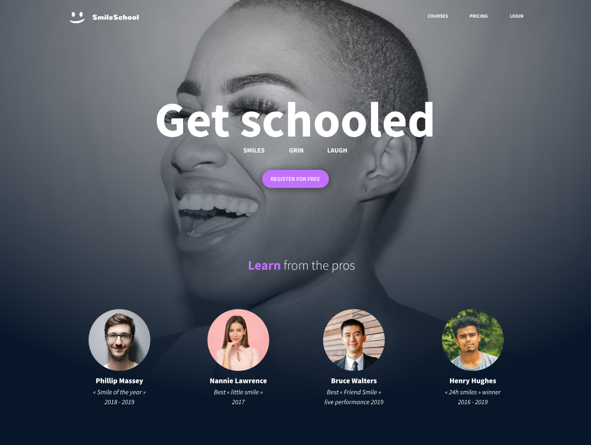

# alx-smiling-school

> Implementing a design with bootstrap

## Description:bulb:
Implement 3 web pages with bootstrap, using all HTML/CSS/Accessibility/Responsive design/Bootstrap knowledges learned previously.

The objective is simple: Have a fully functional web page that looks the same as the designer file.

> This webpage has been designed by Nicolas Philippot, UI/UX designer.

## Live demo:computer:
[Smile School](https://Mahiuha.github.io/alx-smiling-school/)

---

## Project Notes:books:
* Be familiar with Figma.
* Use Bootstrap classes.
* Web pages witch to the tablet version when the screen width is 768px.
* Web pages switch to the mobile version when the screen width is 576px.
* Simple HTML structure.

---

## Author
* **Joseph Mahiuha** - [Mahiuha](https://github.com/Mahiuha) - [twitter:speech_balloon:](https://twitter.com/Joseph_Mahiuha)
